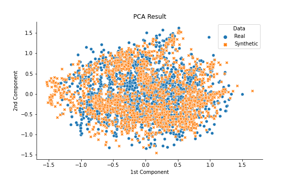
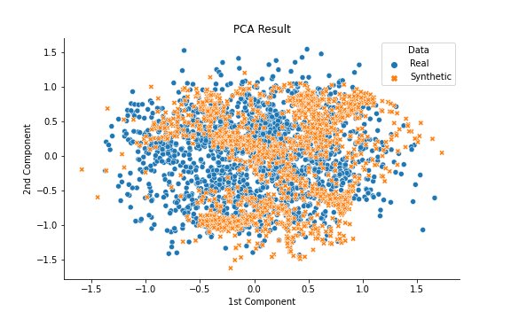
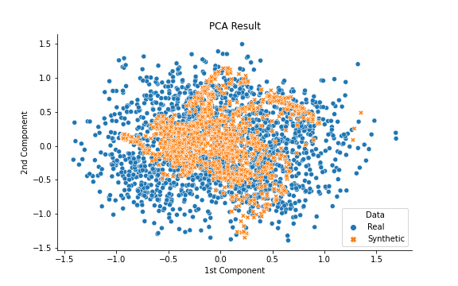
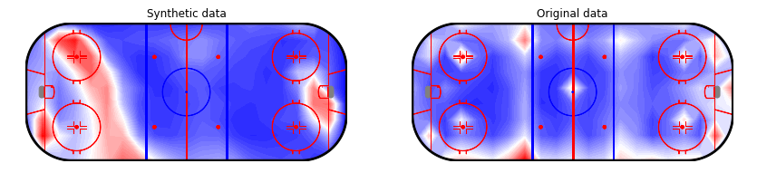
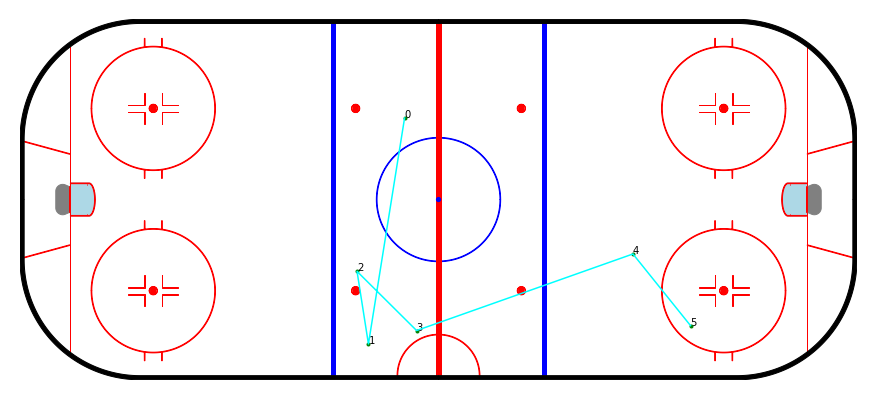

# Sequential Ice Hockey Events Generation using Generative Adversarial Network

In this project, we have generated sequential ice hockey events and coordinates using TimeGAN [1]. We have used the ydata-synthetic [2] to train the TimeGAN. Beside TimeGAN, we have implemented two LSGAN architectures. For plotting the coordinates, we have used hockey rink library [3]. For evaluation, we have used PCA plot and a sequence prediction task to evaluate the synthetic data.

Here is the PCA plots for the synthetic data from three different models. Left most plot is from TimeGAN, the middle one is from LSGAN-GRU model and the right most is from LSGAN-LSTM model.

  
   
  

We also showed the goal heatmap of the original and synthetic data.

  

Here is the synthetic sequential pattern that leads to a goal.

  

**Code Files Description**

1. To train TimeGAN: run the `train_timegan.py` file.
2. To train LSGAN with two variants: run the `train_lsgan.py` file.
3. Preprocess the data: follow the `data_preprocess.ipynb` file.
4. To run the visual evaluation (PCA): follow the `visual_evaluation.ipynb` file.
5. To run the sequential prediction evaluation: follow the `sequence_prediction_eval.ipynb` file.
6. To see the goal pattern: follow the `goal_pattern.ipynb` file. 

Reference:

1. https://papers.nips.cc/paper/2019/hash/c9efe5f26cd17ba6216bbe2a7d26d490-Abstract.html
2. https://github.com/ydataai/ydata-synthetic
3. https://github.com/the-bucketless/hockey_rink